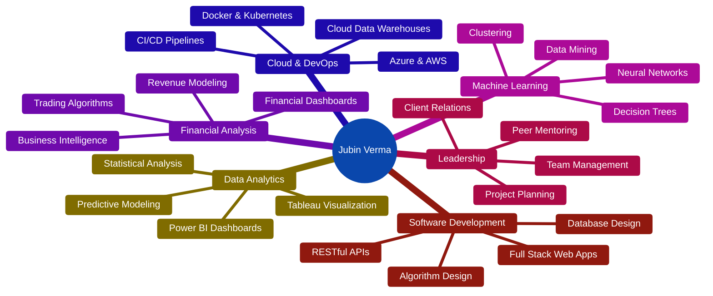

<div align="center">

# 👨‍💻 Jubin Verma


### 🎓 Computer Programming Graduate | 3.7 GPA | President's Honour List
### 📍 Toronto, ON | 🇨🇦 Authorized to Work in Canada

<p align="center">
  <a href="https://my-portfolio-website-lime-two.vercel.app/"></a>
  <a href="https://linkedin.com/in/jubinverma"></a>
  <a href="mailto:jubinverma25@gmail.com"></a>
  <a href="tel:6472812482"></a>
</p>


</div>

---

## 🎮 Game Development Projects

<div align="center">

### 🗡️ Gilva - 3D RPG Game Environment

[](https://jvcrown72.artstation.com/projects/y4GrAO)


**🌴 Jungle Weapons Stall Environment**

A fully realized 3D environment for an RPG game featuring a detailed weapons merchant stall nestled in a lush jungle setting. This project showcases advanced 3D modeling, texturing, and level design skills.

<table>
<tr>
<td align="center" width="33%">
<br/>
<b>Modeled in Blender</b><br/>
High-poly 3D assets with<br/>optimized topology
</td>
<td align="center" width="33%">
<br/>
<b>Implemented in Unity</b><br/>
Real-time lighting &<br/>interactive elements
</td>
<td align="center" width="33%">
<br/>
<b>Enhanced in Unreal</b><br/>
Advanced shaders &<br/>cinematic quality
</td>
</tr>
</table>

### 🎨 Skills Demonstrated


**🔗 [View Full Project on ArtStation →](https://jvcrown72.artstation.com/projects/y4GrAO)**

</div>

---

## 🚀 About Me

<table>
<tr>
<td width="50%" valign="top">

### 👨‍💻 Who Am I?

Hey! I'm **Jubin Verma**, a versatile **Full Stack Developer**, **Data Analyst**, and **Game Developer** based in **Toronto, Ontario** 🇨🇦

🎓 **Computer Programming Graduate** from Seneca Polytechnic  
📊 **3.7 GPA** | President's Honour List  
💼 **Open to:** Junior Developer, Data Analyst & Game Developer roles  
🌍 **Work Authorization:** PGWP Valid until March 2026

</td>
<td width="50%" valign="top">

### 🎯 Quick Facts

```yaml
name: Jubin Verma
role: Full Stack Developer | Data Analyst | Game Developer
location: Toronto, ON 🇨🇦
languages: [Python, C++, C#, Java, JavaScript, SQL]
specialties: [Web Dev, ML, Financial Analytics, Game Dev]
tools: [Unity, Unreal Engine, Blender, Power BI, AWS]
interests: [3D Modeling, AI, Financial Tech, RPG Games]
currently: Building trading algorithms & 3D game environments
available_for: Full-time | Contract | Co-op
```

</td>
</tr>
</table>

<div align="center">

### 🔥 What I'm Passionate About

<table>
<tr>
<td align="center" width="20%">
<br/>
<b>Full Stack Development</b><br/>
Building scalable web apps from frontend to backend
</td>
<td align="center" width="20%">
<br/>
<b>Data Analytics</b><br/>
Turning raw data into actionable business insights
</td>
<td align="center" width="20%">
<br/>
<b>Machine Learning</b><br/>
Building predictive models & AI solutions
</td>
<td align="center" width="20%">
<br/>
<b>Financial Tech</b><br/>
Creating algorithmic trading systems
</td>
<td align="center" width="20%">
<br/>
<b>Game Development</b><br/>
3D environments & immersive experiences
</td>
</tr>
</table>

### 📈 Current Focus

🔭 Building ML-powered financial trading algorithms  
📊 Creating real-time data visualization dashboards  
🎮 Developing 3D game environments & RPG systems  
🤖 Exploring robotics & IoT integrations  
☁️ Learning advanced cloud architectures (Azure, AWS, GCP)  
🌱 Deepening expertise in AI/ML and Big Data  
💼 **Actively seeking Junior Developer | Data Analyst | Game Developer opportunities**

</div>

---

## 🛠️ Technical Arsenal

<div align="center">

### 💻 Programming Languages


### 🎨 Frontend Development


### ⚙️ Backend & Frameworks


### 🗄️ Databases & Data Storage


### 📊 Data Analytics & Business Intelligence


### 🤖 Machine Learning & AI


### ☁️ Cloud & DevOps


### 🎮 Game Development


### 🧰 Tools & Platforms


</div>

---

## 💼 Professional Experience Highlights

<table>
<tr>
<td width="50%">

### 💹 Financial Data Analyst
**Personal Trading Algorithm** | *Jan 2024 - Present*

- 🐍 Built Python algorithms for financial data extraction
- 📈 99.9% data accuracy processing 10K+ transactions
- 🤖 30% revenue improvement via predictive modeling
- 📊 20+ business metrics tracking with Power BI

</td>
<td width="50%">

### 🗃️ Database Developer
**FreshCo Retail Analytics** | *Sep 2024 - Dec 2024*

- 🔧 Designed 15+ table database handling 10K+ daily records
- ⚡ 75% faster query performance optimization
- 📝 20+ stored procedures for automation
- 🏢 Enterprise-level data warehousing

</td>
</tr>
<tr>
<td width="50%">

### 🌍 Full-Stack Developer
**Climate Solutions Platform** | *May 2024 - Aug 2024*

- 🌐 Served 1,000+ users with REST APIs
- 📊 40% user engagement boost
- 🔄 End-to-end data pipeline development
- 👥 Cross-functional team collaboration

</td>
<td width="50%">

### 🏆 Leadership & Achievements

- 📸 **President** - Photography Club (500+ members)
- 🎓 **President's Honour List** - 4.0 GPA
- 🤖 **Hackathon Runner-up** - U of T UltraHack
- 👨‍🏫 **Peer Mentor** - 25+ students mentored

</td>
</tr>
</table>

---

## 🎮 Game Development Projects

<div align="center">

### 🗡️ Gilva - 3D RPG Game Environment

[](https://jvcrown72.artstation.com/projects/y4GrAO)


**🌴 Jungle Weapons Stall Environment**

A fully realized 3D environment for an RPG game featuring a detailed weapons merchant stall nestled in a lush jungle setting. This project showcases advanced 3D modeling, texturing, and level design skills.

<table>
<tr>
<td align="center" width="33%">
<br/>
<b>Modeled in Blender</b><br/>
High-poly 3D assets with<br/>optimized topology
</td>
<td align="center" width="33%">
<br/>
<b>Implemented in Unity</b><br/>
Real-time lighting &<br/>interactive elements
</td>
<td align="center" width="33%">
<br/>
<b>Enhanced in Unreal</b><br/>
Advanced shaders &<br/>cinematic quality
</td>
</tr>
</table>

### 🎨 Skills Demonstrated


**🔗 [View Full Project on ArtStation →](https://jvcrown72.artstation.com/projects/y4GrAO)**

</div>

---

## 🚀 Featured Projects

<div align="center">

### 📊 Multi-Platform Analytics Dashboard
[](https://github.com/JubinVerma)


End-to-end data pipeline processing 500+ daily transactions with machine learning (clustering, neural networks) for predictive analytics. Built intuitive dashboards reducing data interpretation time by 40%.

---

### 🗺️ Route Optimization System
[](https://github.com/JubinVerma/Route-Optimization-System)


Implemented advanced route optimization with comprehensive testing achieving 30% efficiency improvement. Complete technical documentation with complexity analysis and performance benchmarking.

---

### 🌱 Climate Solutions Website
[](https://assignment-6-gamma-beryl.vercel.app/)
[](https://github.com/JubinVerma)


Full-stack platform serving 1,000+ daily users with WCAG 2.1 compliance. Comprehensive authentication, audit trails, and multi-platform responsive design.

---

### 🏪 FreshCo Database Model
[](https://github.com/JubinVerma/FreshCo-DataBase-Simple-Model)


Enterprise-level database with 15+ normalized tables supporting 10,000+ records. 20+ stored procedures with 100% data validation coverage and comprehensive ERD documentation.

---

### 🤖 UltraHack Autonomous Robot
[](https://github.com/JubinVerma/UtraHackFeb2025)


**🏆 Runner-up at University of Toronto Hackathon 2024**

Built fully autonomous robot in 48-hour challenge with team of 5. Achieved 85% success rate in maze navigation with sensor fusion and real-time obstacle avoidance.

</div>

---

## 📈 GitHub Analytics

<div align="center">
  


## 📊 My Language Expertise

<div align="center">

### 💻 Most Used Languages

<table>
<tr>
<td width="50%">

**C++**  


**Java**  


**Python**  


**HTML**  


**CSS**  


**JavaScript**  


**C#**  


**SQL**  


**R**  


</td>
<td width="50%">

### 🎯 Proficiency Levels


</td>
</tr>
</table>

</div>

</div>

---

## 🏆 Achievements & Certifications

<div align="center">


</div>

<table align="center">
<tr>
<td align="center" width="25%">
<br/>
<b>President's Honour List</b><br/>
4.0 GPA - Summer 2024
</td>
<td align="center" width="25%">
<br/>
<b>UltraHack Runner-up</b><br/>
University of Toronto 2024
</td>
<td align="center" width="25%">
<br/>
<b>Peer Mentor</b><br/>
25+ Students | 30% Retention ↑
</td>
<td align="center" width="25%">
<br/>
<b>Club President</b><br/>
500+ Members | $6K Budget
</td>
</tr>
</table>

---

## 📊 Contribution Activity

<div align="center">


</div>

---

## 💡 Core Competencies

<div align="center">



</div>

---

## 🎯 What I'm Currently Up To

<table>
<tr>
<td width="50%" valign="top">

### 🔭 Current Projects
- 💹 Developing ML-powered trading algorithms
- 📊 Building real-time analytics dashboards
- 🎮 Creating 3D RPG game environments (Gilva)
- 🤖 Exploring robotics & IoT integrations
- ☁️ Learning advanced cloud architectures

</td>
<td width="50%" valign="top">

### 🌱 Learning & Growth
- 🧠 Advanced Machine Learning techniques
- ⚡ Real-time data processing at scale
- 🎮 Advanced game mechanics & shader programming
- 🔐 Cybersecurity & data protection
- 📱 Mobile app development (React Native)

</td>
</tr>
<tr>
<td width="50%" valign="top">

### 👯 Open to Collaborate On
- 🌐 Full-stack web applications
- 📈 Data visualization projects
- 🎮 Indie game development
- 🤖 AI/ML implementations
- 💼 Financial tech solutions

</td>
<td width="50%" valign="top">

### 💼 Career Opportunities
- 💻 Junior Developer positions
- 📊 Data Analyst roles
- 🎮 Game Developer positions
- 🔧 Full Stack Engineer
- 🎯 Business Intelligence Analyst

</td>
</tr>
</table>

---

## 📬 Let's Connect!

<div align="center">

### I'm always open to interesting conversations and collaboration opportunities!

<p>
<a href="https://my-portfolio-website-lime-two.vercel.app/"></a>
<a href="https://linkedin.com/in/jubinverma"></a>
<a href="mailto:jubinverma25@gmail.com"></a>
<a href="tel:6472812482"></a>
</p>

### 📍 Based in Toronto, Ontario | 🇨🇦 Authorized to Work in Canada

**💼 Available for immediate start | Full-time or Contract positions**


</div>

---

## 💭 Random Dev Quote

<div align="center">


</div>

---

## 🐍 Contribution Snake

<div align="center">


</div>

---

<div align="center">

### ⭐ Show Some Love!

**If you like what you see, feel free to star some repositories!**


### 💻 "First, solve the problem. Then, write the code." - John Johnson

**Thanks for visiting! Let's build something amazing together! 🚀**

</div>
